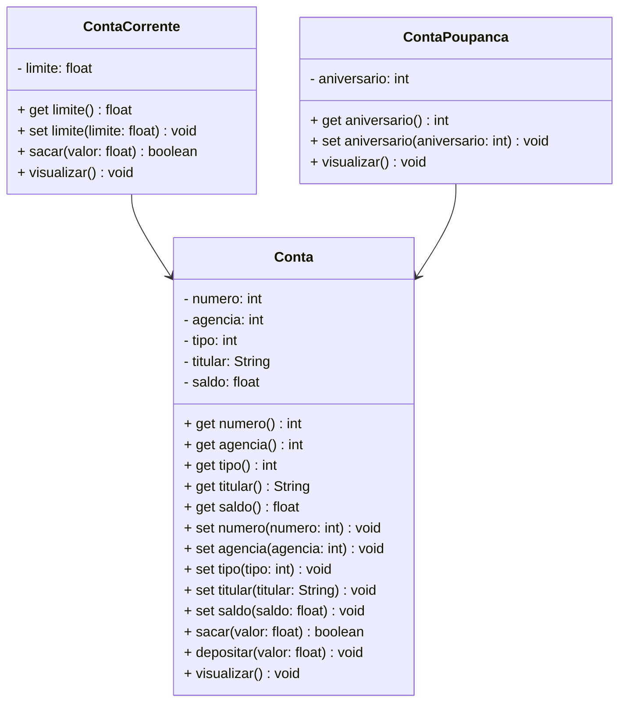

# Projeto Conta Bancária - Java

 

	

 

  
  
  
  
  
  

---

 

## 1. Descrição

 

O **Projeto Conta Bancária** é um sistema de gestão projetado para simular e administrar operações financeiras relacionadas a contas bancárias. Oferece funcionalidades como **cadastro**, **consulta**, **atualização** e **remoção** de contas, além de transações como depósitos, saques e transferências.

O sistema organiza as informações dos clientes — incluindo nome do titular, número da conta, saldo e tipo de conta — garantindo a realização segura das operações. Seu principal objetivo é automatizar e simplificar o gerenciamento de contas bancárias, como Conta Corrente e Conta Poupança, promovendo agilidade e precisão no controle financeiro.

Este projeto, desenvolvido em **Java**, foca no estudo e aplicação dos conceitos de **Programação Orientada a Objetos (POO)**, incluindo:

- Classes e Objetos;
- Atributos e Métodos;
- Modificadores de Acesso;
- Herança e Polimorfismo;
- Classes Abstratas;
- Interfaces.

Além de servir como um simulador funcional, o projeto oferece uma base prática para compreender os princípios fundamentais da POO aplicados a um cenário realista.

 

## 2. Funcionalidades do Projeto

 

1. **Criar Conta:** Cria uma nova conta bancária especificando nome do titular, número da agência, saldo inicial e propriedades específicas conforme o tipo da conta. O número da conta é gerado automaticamente.
2. **Listar todas as Contas:** Lista todas as contas cadastradas no sistema.
3. **Consultar uma Conta pelo número:** Encontra uma conta pelo número.
4. **Consultar uma Conta pelo titular:** Encontra uma ou mais contas associadas ao nome do titular.
5. **Editar Conta:** Permite atualizar os dados de uma conta existente a partir do número da conta.
6. **Excluir Conta:** Remove uma conta específica com base no número da conta.
7. **Sacar:** Realiza a retirada de um valor de uma conta, desde que o saldo seja suficiente.
8. **Depositar:** Adiciona um valor ao saldo de uma conta existente.
9. **Transferir:** Transfere um valor de uma conta para outra, respeitando os respectivos saldos e limites.

 

## 3. Diagrama de Classes

 

Um **Diagrama de Classes** é um modelo visual usado na programação orientada a objetos para representar a estrutura de um sistema. Ele exibe classes, atributos, métodos e os relacionamentos entre elas, como associações, heranças e dependências.

Esse diagrama ajuda a planejar e entender a arquitetura do sistema, mostrando como os componentes interagem e se conectam. É amplamente utilizado nas fases de design e documentação de projetos.

Abaixo, você confere o Diagrama de Classes do Projeto Conta Bancária:

 

## 4. Tela Inicial do Sistema - Menu

 

   

 

---

### Desenvolvido por [Junior Reis](https://github.com/JuniorReis-dev/conta_bancaria)
